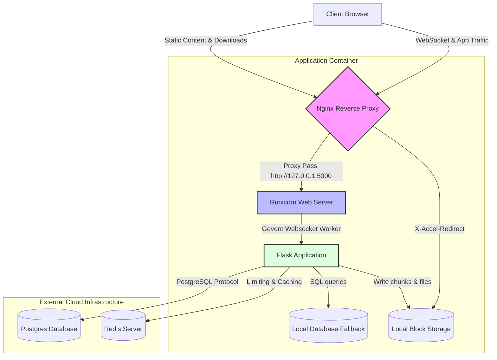
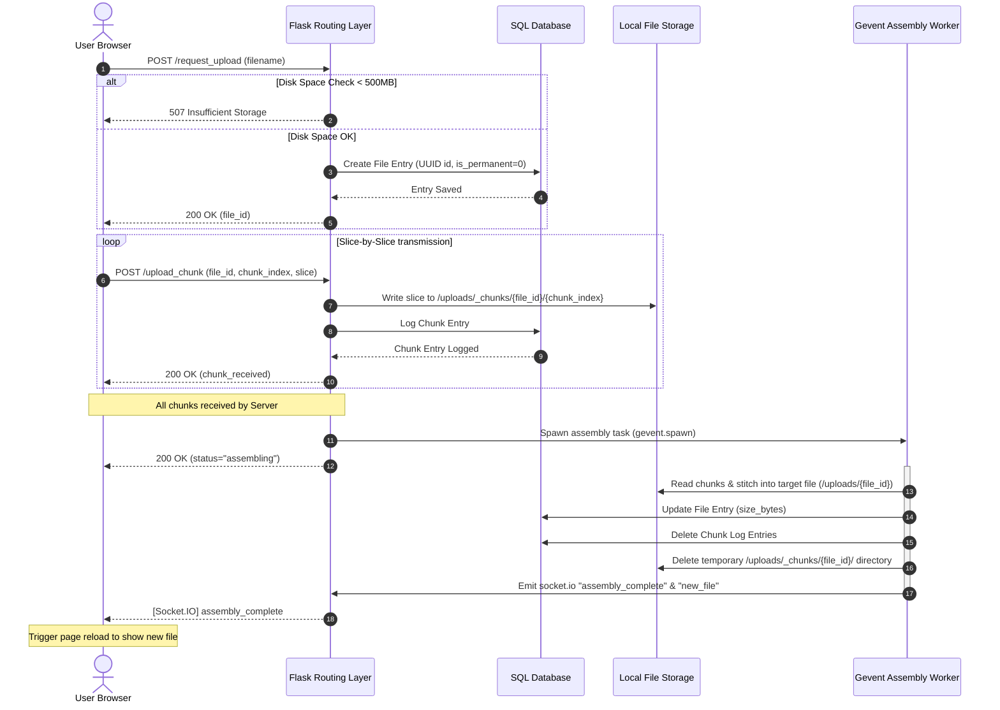

# 📁 File Board

[](https://opensource.org/licenses/MIT)
[](https://www.python.org/)
[](https://flask.palletsprojects.com/)
[](https://nginx.org/)
[](https://www.gevent.org/)
[](https://www.postgresql.org/)

**File Board** is an industry-standard, production-hardened, high-performance file sharing platform. Built on top of Flask and optimized with a highly resilient concurrent infrastructure, File Board is engineered to handle large file uploads (up to 1GB) with high reliability, automated resource cleanup, database self-healing, and a beautiful minimalist front-end.

> 🌐 **Live Demo:** [https://file-board.onrender.com/](https://file-board.onrender.com/)

---

## 📖 Table of Contents
1. [Key Features](#-key-features)
2. [Architectural Highlights & Resilience Engineering](#-architectural-highlights--resilience-engineering)
3. [System Architecture & Lifecycle Flows](#%EF%B8%8F-system-architecture--lifecycle-flows)
4. [File Directory Structure](#-file-directory-structure)
5. [Technology Stack](#-technology-stack)
6. [Configuration & Environment Variables](#-configuration--environment-variables)
7. [Local Quickstart Guide](#-local-quickstart-guide)
8. [Production Deployment Guide](#-production-deployment-guide)
9. [API Reference & Route Specs](#-api-reference--route-specs)
10. [Automated Testing Framework](#-automated-testing-framework)
11. [License](#-license)

---

## 🚀 Key Features

*   **⚡ Chunked Uploads (Resumable)**: Slices large files (up to 1GB) into 5MB chunks on the client side, uploading them concurrently and asynchronously assembling them on the server to prevent standard HTTP timeout failures.
*   **🛡️ Multi-Tier Resilience**: Gevent monkey-patching for non-blocking DNS, auto-retry database wake-ups, fast-fail connection pooling, and in-memory rate-limiting isolations.
*   **⏲️ Automatic Space Reclamation**: A safe, background cleanup worker deletes files older than 15 minutes and automatically handles database records, partial chunk folders, and storage allocations.
*   **🔒 Secure Admin Dashboard**: An authenticated command center (`/admin`) with login credentials synchronization, allowing operators to mark files as permanent, inspect storage metrics in real-time, or manually purge files.
*   **🌐 Real-Time Status Updates**: Employs WebSocket notifications (`Socket.IO`) to synchronize uploads, assembly notifications, deletions, and file registry lists across all open clients instantly.
*   **📂 Zero-Copy File Serving**: Leverages Nginx's `X-Accel-Redirect` to serve completed file downloads directly, freeing the Flask-WSGI application thread from heavy input/output operations.

---

## 🛡️ Architectural Highlights & Resilience Engineering

FileBoard goes beyond standard CRUD web apps, incorporating professional systems engineering patterns:

### 1. Zero-Hang Database Connectivity
Free-tier database hosting (like Render's PostgreSQL) often experiences database pauses or cold boots. FileBoard implements connection-pool hardening to handle this seamlessly:
*   **Connection Timeout Optimization**: Forces a 10s connection timeout and aggressive keepalives (`connect_timeout=10&keepalives=1&keepalives_idle=10&keepalives_interval=5&keepalives_count=3`) on PostgreSQL strings to prevent thread lockups.
*   **Pre-Ping Validation**: Uses SQLAlchemy's `pool_pre_ping=True` to run an validation query (`SELECT 1`) on every checkout, discarding dead database connections instantly.
*   **Pool Lifecycle Limits**: Recycles database connections at 280 seconds (`pool_recycle=280`) to bypass Render's default 5-minute idle-connection reaper.
*   **Warmup Routine**: Executes 3 placeholder queries on startup, pre-establishing connections inside the pool to guarantee the first visitor's request is served instantly.

### 2. Dual-Layer Upload Resilience
Large uploads are split into 5MB slices on the browser.
*   **CSRF Bypass for Chunks**: While standard routes use strict `Flask-WTF` CSRF validation, chunk uploads are exempted since the upload transaction is authenticated by a unique, cryptographically secure `file_id` generated on `/request_upload`. This prevents long-running uploads from failing due to CSRF token expiration.
*   **Asynchronous Assembly**: The reconstruction of slices into a single file is fully offloaded to an asynchronous greenlet (`gevent.spawn`), preventing thread blockage on the Flask backend.

### 3. Stateless Rate Limiting
To prevent single-point-of-failure hangs, Flask-Limiter is configured with a pure in-memory store (`memory://`). Even if a Redis container experiences high latency, server rate-limiting falls back gracefully and runs with zero external round-trip dependencies.

### 4. Background Storage Reclamation & File Locking
Files uploaded by public users expire after 15 minutes unless toggled to `Permanent` by the admin. 
*   **File Locks**: An active cleanup task runs every 5 minutes in a separate gevent worker. It creates a `.cleanup.lock` file containing the PID inside the instance folder to prevent multi-process thrashing or race conditions when scaling.
*   **Resource Isolation**: Background cleanup tasks actively clean up incomplete chunks, database rows in the `Chunk` table, database files in the `File` table, and release system resources without blocking incoming user traffic.

---

## 🗺️ System Architecture & Lifecycle Flows

### 💻 Infrastructure Topology

FileBoard utilizes Nginx as an edge reverse-proxy and static server, delegating application traffic to a Gunicorn instance driving Flask via Gevent greenlets:



### ⚡ Chunked Upload & Assembly Lifecycle

This sequence diagram illustrates the transaction between the browser, Flask application layer, and background workers during a file upload:



---

## 📁 File Directory Structure

A layout of FileBoard's structural composition:

```text
├── .env                  # Active environment credentials (git-ignored)
├── .gitignore            # Git exclusion rules
├── Dockerfile            # Multi-stage production container configuration
├── README.md             # Core application documentation (Current)
├── ads.txt               # AdSense validation file
├── app.py                # Main backend codebase (models, jobs, routes, logic)
├── docker-compose.yml    # Service mesh for Nginx, Python Web, Postgres, and Redis
├── example.env           # Deployment reference environment file
├── nginx.conf            # Nginx proxy, static cache, and Accel-Redirect definition
├── readme.local.md       # Dev description details
├── render.yaml           # Automated cloud blueprints blueprint file (Render specification)
├── requirements.txt      # Python dependencies manifest
├── runtime.txt           # Python runtime target specifier
├── start.sh              # Orchestration entrypoint script (DNS diagnostics, Gunicorn & Nginx launcher)
├── static/
│   └── style.css         # Clean, minimalist custom stylesheet
├── templates/
│   ├── 404.html          # Custom resource-not-found page
│   ├── 500.html          # Custom internal server exception page
│   ├── admin.html        # Secure operator control center
│   ├── admin_login.html  # Secure operator login page
│   ├── db_error.html     # Real-time database waking/maintenance error viewport
│   └── index.html        # Beautiful user interface with chunk-slicing JavaScript logic
└── tests/
    ├── conftest.py       # Pytest fixtures and mock environments
    └── test_app.py       # Integration and unit tests
```

---

## 🛠️ Technology Stack

FileBoard combines trusted Python libraries with performance-oriented system software:

*   **Backend & WSGI**: [Flask 3.0.3](https://flask.palletsprojects.com/) & [Gunicorn 23.0.0](https://gunicorn.org/)
*   **Database & ORM**: [SQLAlchemy](https://www.sqlalchemy.org/) & [Flask-SQLAlchemy 3.1.1](https://flask-sqlalchemy.readthedocs.io/)
*   **Asynchronous Engine**: [Gevent 24.2.1](https://www.gevent.org/) (monkey-patched for non-blocking Socket and IO pools)
*   **WebSockets**: [Flask-SocketIO 5.3.6](https://flask-socketio.readthedocs.io/) & [Python-SocketIO 5.11.4](https://python-socketio.readthedocs.io/)
*   **Rate Limiter**: [Flask-Limiter 3.13](https://flask-limiter.readthedocs.io/)
*   **Reverse Proxy & Server**: [Nginx](https://nginx.org/)
*   **Testing**: [Pytest](https://docs.pytest.org/)

---

## ⚙️ Configuration & Environment Variables

Create a local `.env` file or define these parameters on your hosting platform:

| Variable | Description | Default | Requirements |
| :--- | :--- | :--- | :--- |
| `SECRET_KEY` | Cryptographic signature key for session cookies. | `super-secret-key` | Change in production |
| `ADMIN_USER` | Authorized administrator username. | `admin` | Minimum 4 characters |
| `ADMIN_PASS` | Authorized administrator password. | `admin123` | Minimum 6 characters |
| `DATABASE_URL` | SQLAlchemy URL for the primary DB (PostgreSQL / SQLite). | *Required* | Must support psycopg2 |
| `REDIS_URL` | Redis instance URL. Falls back to in-memory rates if unavailable. | *Optional* | e.g. `redis://127.0.0.1:6379` |
| `MIN_FREE_SPACE_GB` | Hard storage floor limit in Gigabytes before rejecting uploads. | `1` | Integer value |

---

## 💻 Local Quickstart Guide

Ensure you have [Docker](https://www.docker.com/) and `docker-compose` installed.

### 🐳 Option A: Using Docker Compose (Recommended)

Running the application using Docker Compose builds the image, provisions the local Postgres database, coordinates a Redis instance, and configures the Nginx front-facing proxy.

1.  **Clone the Repository**:
    ```bash
    git clone https://github.com/Priyanshu-x/file-board.git
    cd file-board
    ```
2.  **Generate Environment Settings**:
    Configure your `.env` variables or use the pre-configured database defaults defined in `docker-compose.yml`.
3.  **Boot the Architecture**:
    ```bash
    docker-compose up --build
    ```
4.  **Access the Application**:
    Open your browser and navigate to **`http://localhost`** (Nginx acts as the entrypoint on port 80).
5.  **Access Admin Controls**:
    Log in at `http://localhost/admin/login` using the default credentials:
    *   **Username**: `admin`
    *   **Password**: `admin123`

---

### 🐍 Option B: Native Manual Installation

For local development without Docker containers:

1.  **Install System Dependencies**:
    Make sure you have `python 3.11` and database header libraries (such as `libpq-dev` for Postgres support) installed.
2.  **Create a Virtual Environment**:
    ```bash
    python -m venv venv
    # On Windows:
    venv\Scripts\activate
    # On macOS/Linux:
    source venv/bin/activate
    ```
3.  **Install Required Dependencies**:
    ```bash
    pip install -r requirements.txt
    ```
4.  **Configure Local Environment Variables**:
    Create a local `.env` file in the root directory:
    ```env
    SECRET_KEY=local-dev-secret-key-string-here
    ADMIN_USER=devadmin
    ADMIN_PASS=devadminpassword123
    DATABASE_URL=sqlite:///files.db
    ```
5.  **Start Gunicorn (Unix/macOS)**:
    ```bash
    ./start.sh
    ```
    *Or run natively using Flask's development server (Windows/Local Dev)*:
    ```bash
    python app.py
    ```
6.  **Navigate to standard address**:
    Visit the application locally at `http://127.0.0.1:5000`.

---

## 🌐 Production Deployment Guide

FileBoard includes a production-ready cloud descriptor configuration designed to deploy directly to [Render](https://render.com/).

### ☁️ Automated Blueprint Deployment (Render)

Using the built-in `render.yaml` template, the platform deploys the Flask application with Docker, provisions a Redis container, and attaches an active Postgres cluster.

1.  Commit all changes to your private fork.
2.  Go to the Render Dashboard and choose **Blueprints**.
3.  Connect your FileBoard repository.
4.  Render will configure:
    *   A **Web Service** running FileBoard inside a Docker environment.
    *   A **PostgreSQL Database** running on the free tier.
    *   A **Redis Service** handling cache allocations.
5.  All variables (including database URIs and cryptographic secrets) are bound automatically.

---

### 🛡️ Production Nginx Hardening

In production environments, the Nginx container provides highly optimized configuration parameters (`nginx.conf`):

```nginx
# Buffering optimizations for massive file streams
proxy_request_buffering off;
proxy_buffering off;

# Heavy connection timeouts for background chunk assembly processes
proxy_read_timeout 600s;
proxy_connect_timeout 600s;
proxy_send_timeout 600s;

# Zero-Copy static downloads (X-Accel-Redirect)
location /internal_uploads/ {
    internal;
    alias /app/instance/uploads/;
}
```

By passing down an `X-Accel-Redirect` header (`/internal_uploads/file_id`), Flask hands the file stream back to Nginx, enabling zero-copy transfers that conserve Python memory and CPU resources.

---

## 🔌 API Reference & Route Specs

| Route | HTTP Method | Auth Required | Description | Payload / Parameter |
| :--- | :--- | :--- | :--- | :--- |
| `/` | `GET` | No | Renders the primary user interface and lists public files. | *None* |
| `/request_upload` | `POST` | No | Initiates a file upload transaction and returns a `file_id`. | Form Data: `{filename: "..."}` |
| `/upload_chunk` | `POST` | No | Accepts an individual slice chunk for the specified upload session. | Multipart Form Data: `file_id`, `chunk_index`, `total_chunks`, `file` (binary blob) |
| `/download/<file_id>` | `GET` | No | Downloads the corresponding file using Nginx redirection. | `file_id` (UUID path parameter) |
| `/admin` | `GET` | **Yes** | Shows storage capacities and lists all uploads with action commands. | *None* |
| `/admin/login` | `GET/POST`| No | Provides administrator session authentication. | Form Data: `username`, `password` |
| `/admin/logout` | `GET` | **Yes** | Terminates the administrative session. | *None* |
| `/admin/manage` | `POST` | **Yes** | Executes management actions (either `delete` or `make_permanent`).| Form Data: `file_id`, `action` |
| `/health` | `GET` | No | System health endpoint (monitored by Docker/Render). Returns `OK` (200) or `DEGRADED` (200). | *None* |
| `/ads.txt` | `GET` | No | Serves the AdSense validation file. | *None* |

---

## 🧪 Automated Testing Framework

FileBoard includes unit and integration tests using `pytest`. Database actions are mocked using a clean, in-memory SQLite backend.

### 🧪 Executing the Test Suite

1.  Make sure development dependencies are installed:
    ```bash
    pip install pytest
    ```
2.  Run the tests from the root directory:
    ```bash
    pytest
    ```
3.  The suite covers:
    *   Primary viewport rendering.
    *   Admin dashboard authentication policies and error handshakes.
    *   File deletion controls.
    *   Stateless guest interactions.

---

## 📄 License

Distributed under the MIT License. See [LICENSE](LICENSE) for more details.

---
*FileBoard — Engineered for extreme performance, security, and cloud resilience.*
